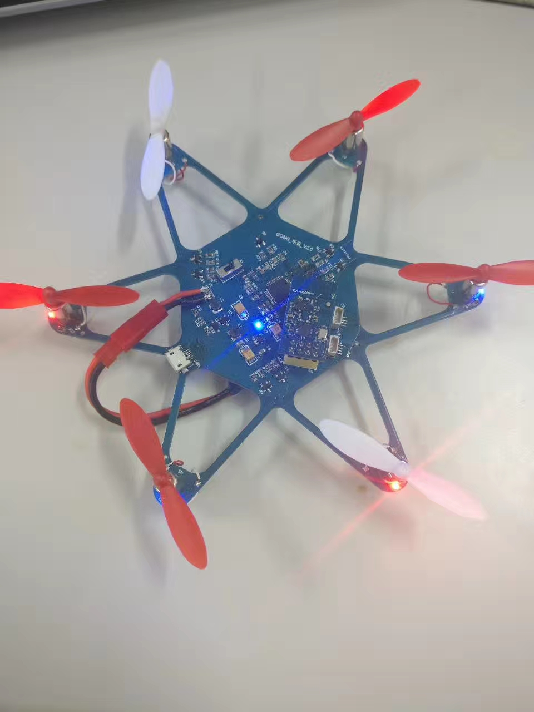
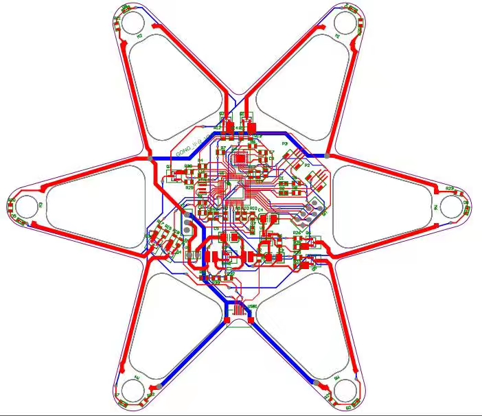

# 项目效果
## 深度学习end-to-end车位识别算法
* 平台：德州仪器TDA4
* 模型指标评估：精确率>98%,召回率>95%,车位角点精度<7cm
* 实机模型评估：C7x(DSP)占用率<10%,单次推理耗时6~7ms

## 深度学习手势识别项目

##  自动泊车——车位识别图像算法（传统算法）

*   算法能适应**明暗极度不均**

*   算法能适应环境的光的**突然变化** 

*   算法能适应**车位被柱子遮挡**的工况
*   算法在**较好环境**下能**稳定识别**出**两个车位**

*   算法在**地上停车位**的识别效果,该车位颜色不均匀，噪声较大

##  AR-HUD——导航箭头动画算法

*   箭头符合物理规律，由近至远的同时由快变慢、由大变小
*   箭头具有透视效果，紧贴地面运动

`AR-HUD导航箭头动画算法——直行`

`AR-HUD导航箭头动画算法——左转`

`AR-HUD导航箭头动画算法——右转`

##  在校期间校企合作项目——目标定位算法设计

* 坐标精度达一丝，角度精度达0.1度
  

* 算法在工厂的**应用**(视觉**精准定位**芯片与孔位的坐标与角度，实现全自动芯片转移)

  

##  毕业设计作品——六旋翼飞行器（ARM处理器）

*   实物图

*   原理图

